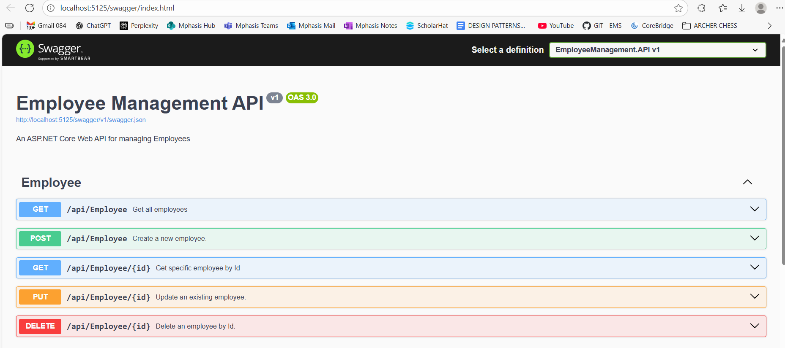

# 📘 Employee Management System (EMS) API

A **.NET 8 Web API** project implementing **CRUD operations** on Employees using:

* **Entity Framework Core (Database-First approach)**
* Clean Architecture patterns: Repository, Unit of Work, Service Layer
* DTOs, AutoMapper, FluentValidation
* Global Error Handling & Logging with Serilog
* Swagger (OpenAPI) with XML Comments
* Pagination & Postman Collection for API usability

This project is structured as a **portfolio-ready solution** to demonstrate backend development and architectural best practices in interviews.

---

## 🛠 Tech Stack

* **.NET 8 / C# 8.0**
* **Entity Framework Core (DB-First with SQLite)**
* **Repository + Unit of Work Pattern**
* **Dependency Injection**
* **AutoMapper**
* **FluentValidation**
* **Serilog** (console, file, SQL Server sinks)
* **Swagger / OpenAPI (Swashbuckle)**
* **xUnit** (unit testing with InMemory provider)

---

## 🚀 How to Run

1. Clone the repo:

   ```bash
   git clone [(https://github.com/deepak-khare2015/EmployeeManagementSystem.git)]
   cd ems-api
   ```

2. Restore dependencies:

   ```bash
   dotnet restore
   ```

3. Run EF Core DB-First scaffolding (if regenerating from DB):

   ```bash
   dotnet ef dbcontext scaffold "Data Source=ems.db" Microsoft.EntityFrameworkCore.Sqlite -o Models
   ```

4. Run the API:

   ```bash
   dotnet run
   ```

5. Open Swagger UI:

   ```
   https://localhost:5125/
   ```

---

## 📂 Project Structure

```plaintext
EMS-API/
│── Controllers/
│   └── EmployeeController.cs          # API endpoints (CRUD + XML docs + Serilog)
│
│── DAL/
│   └── Repositories/
│       ├── IRepository.cs             # Generic repository interface
│       ├── Repository.cs              # Generic repository implementation
│       ├── IEmployeeRepository.cs     # Employee-specific repo interface
│       └── EmployeeRepository.cs      # Employee repo implementation
│
│── Infrastructure/
│   └── UnitOfWork.cs                  # Unit of Work implementation
│
│── Services/
│   ├── IEmployeeService.cs            # Employee service contract
│   └── EmployeeService.cs             # Business logic for employees
│
│── DTOs/
│   ├── EmployeeDto.cs                 # Read DTO
│   ├── EmployeeCreateDto.cs           # Create DTO
│   └── EmployeeUpdateDto.cs           # Update DTO
│
│── Validators/
│   └── EmployeeValidator.cs           # FluentValidation rules
│
│── Mappings/
│   └── AutoMapperProfile.cs           # AutoMapper profile for DTO ↔ Entity
│
│── Middleware/
│   └── ExceptionMiddleware.cs         # Global error handling
│
│── Models/
│   ├── Employee.cs                    # EF Core DB-First entity
│   └── PagedResult.cs                 # Pagination response wrapper
│
│── Logs/
│   └── log-.txt                       # Serilog rolling logs
│
│── Tests/
│   └── RepositoryTests.cs             # xUnit tests (InMemory DB)
│
│── docs/
│   ├── EMS-Postman-Collection.json    # Postman exported collection
│   └── swagger-ui.png                 # Swagger UI screenshot
│
│── Program.cs                         # Startup (Swagger, DI, Logging, Middleware)
│── appsettings.json                   # Config (conn string, logging, etc.)
│── EMS-API.csproj                     # Project file
│── README.md                          # Documentation
```

---

## 📖 Week-by-Week Progress

### ✅ Week 1 — Repository Pattern

* Scaffolded **EF Core DB-First** models (`Employee.cs`).
* Implemented `IRepository<T>` + `Repository<T>` for CRUD.
* Added `IEmployeeRepository` for employee-specific queries.
* Created **unit test skeleton** with xUnit + InMemory provider.

---

### ✅ Week 2 — Unit of Work

* Added `IUnitOfWork` + `UnitOfWork`.
* Centralized transaction commits.

💬 **Talking Point:** Scoped lifetime ensures consistency per request.

---

### ✅ Week 3 — Service Layer + DI

* Added `IEmployeeService` + `EmployeeService`.
* Controllers now delegate to service layer.

💬 **Talking Point:** Thin controllers, SRP, DI best practices.

---

### ✅ Week 4 — DTOs + AutoMapper + Validation

* Added `EmployeeDto`, `EmployeeCreateDto`, `EmployeeUpdateDto`.
* Configured AutoMapper mapping profiles.
* Added FluentValidation rules for Create/Update.

💬 **Talking Point:** DTOs secure contracts, validators ensure integrity.

---

### ✅ Week 5 — Global Error Handling + Logging

* Implemented **ExceptionMiddleware** for consistent error responses.
* Added **Serilog** with console/file sinks.
* Structured logging in controllers with `Log.Information`, `Log.Warning`, `Log.Error`.

💬 **Talking Point:** Logs are structured and correlation-ready.

---

### ✅ Week 6 — Swagger, Pagination, Documentation

* Enabled **Swagger UI at root** (`/`).
* Configured **XML comments** → Swagger shows endpoint descriptions, parameters, sample requests/responses.
* Implemented **Pagination** (`PagedResult<T>`).
* Exported **Postman Collection**.
* Added **Swagger screenshot** for documentation.

📸 Swagger Screenshot:



---

## 🔹 Sample Requests & Responses

### GET Employees (Paginated)

```
GET /api/employees?pageNumber=1&pageSize=2
```

**Response**

```json
{
  "items": [
    { "id": 1, "name": "John Doe", "position": "Manager", "salary": 85000 },
    { "id": 2, "name": "Jane Smith", "position": "Developer", "salary": 60000 }
  ],
  "totalRecords": 42,
  "pageNumber": 1,
  "pageSize": 2
}
```

### POST Employee

```
POST /api/employees
```

**Request**

```json
{
  "name": "Deepak Khare",
  "position": "Software Engineer",
  "salary": 75000
}
```

**Response (201 Created)**

```json
{
  "id": 43,
  "name": "Deepak Khare",
  "position": "Software Engineer",
  "salary": 75000
}
```

### DELETE Employee

```
DELETE /api/employees/43
```

**Response**

```
204 No Content
```

---

## 📁 Postman Collection

Located under `/docs`:

* [EMS-Postman-Collection.json](EmployeeManagement.API/Docs/EMS-Postman-Collection.json)

👉 Import this into Postman → instantly test all endpoints.

---

## 📸 Swagger Screenshot

Swagger UI with XML comments and CRUD endpoints:

